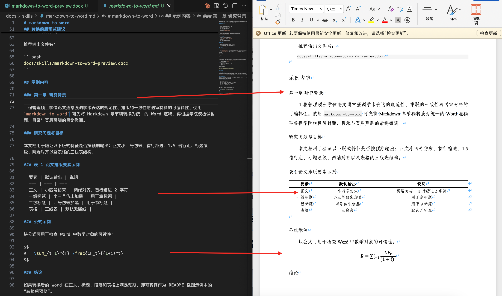

# markdown-to-word

将 Markdown 学术文稿转换为 Word 文档的技能，默认按“浙江大学工程管理硕士学位论文规范要求”的常用正文样式输出，适合论文初稿、章节稿、技术报告与送审前排版底稿。

## 当前默认格式基线

当前转换器默认对齐以下论文正文样式：

- 正文：小四号、仿宋、首行缩进 2 字符
- 段落：1.5 倍行距、两端对齐
- 一级标题：小三号、仿宋、加黑
- 二级标题：四号、仿宋、加黑
- 三级标题：小四号、仿宋
- 图题、表题：五号、单倍行距、居中，并按章连续编号
- 图题、表题支持中英文双标题；若紧跟 `Figure ...` 或 `Table ...` 行，则按两行居中输出，英文行为 `Times New Roman`
- 表格：默认输出三线表
- 页面：A4 纵向，正文页边距上/下 2.54 cm、左/右 3.17 cm
- 英文与数字：`Times New Roman`

说明：

- 上述规则主要对应正文、章节标题、段落、表格等高频论文元素。
- 若学校模板对页眉页脚、页码、封面、声明页、目录、参考文献样式有额外要求，通常建议在生成后的 `.docx` 中继续做精修。

## 已支持能力

- Markdown 标题、段落、列表、引用块
- 行内公式 `$...$` 与块公式 `$$...$$`
- 表格转换，并默认生成三线表风格
- 本地图片插入
- 中文标点与中英文混排的基础清洗
- 数字引文按正文首次出现顺序重编号，并重排“参考文献”章节
- 对缺失类型标识、正文引文缺项、未引用条目输出告警
- 生成后直接打开 `.docx` 预览

## 适用场景

- 将论文章节草稿从 Markdown 快速转为可编辑 Word
- 生成符合浙大工程管理硕士论文正文风格的送审底稿
- 在保留公式、表格、图片的前提下做章节级导出
- 为后续人工微调提供统一排版起点

## 使用方式

在对话中直接点名技能：

- “使用 `markdown-to-word` 将这份 Markdown 章节稿转换为 Word，并按浙江大学工程管理硕士学位论文规范要求输出。”
- “使用 `markdown-to-word` 把这份方法章节导出为 `.docx`，正文小四仿宋、1.5 倍行距、三线表。”

命令行入口：

```bash
skills/markdown-to-word/convert_md_to_docx.sh [-o output.docx] input.md
```

## 转换前后预览建议

为了制作 README 中的“转换前后对比预览图”，建议直接使用本说明页作为演示样例：

1. 转换前：打开 `docs/skills/markdown-to-word.md`
2. 转换后：打开生成的 `.docx`
3. 截取以下对比内容：
   - 标题层级
   - 正文段落的小四仿宋与 1.5 倍行距
   - 两端对齐效果
   - 三线表示例

推荐输出文件名：

```bash
docs/skills/markdown-to-word-preview.docx
```

综合核对样张：

```bash
docs/skills/markdown-to-word-sample.md
```

当前预览图：



## 示例内容

### 第一章 研究背景

工程管理硕士学位论文通常强调学术表达的规范性、排版的一致性与送审材料的可编辑性。使用 `markdown-to-word` 可先将 Markdown 章节稿转换为统一的 Word 底稿，再根据学院模板做封面、目录与页眉页脚的最终微调。

### 研究问题与目标

本文档用于验证以下版式特征是否按预期输出：正文小四号仿宋、首行缩进、1.5 倍行距、标题层级、两端对齐以及表格的三线表结构。

### 表 1 论文排版要素示例

| 要素 | 默认输出 | 说明 |
| --- | --- | --- |
| 正文 | 小四号仿宋 | 两端对齐，首行缩进 2 字符 |
| 一级标题 | 小三号仿宋加黑 | 用于章标题 |
| 二级标题 | 四号仿宋加黑 | 用于节标题 |
| 表格 | 三线表 | 默认无竖线 |

### 公式示例

块公式可用于检查 Word 中数学对象的可读性：

$$
R = \sum_{t=1}^{T} \frac{CF_t}{(1+i)^t}
$$

### 结论

如果转换后的 Word 在正文、标题、段落和表格上满足预期，即可将其作为 README 截图示例中的“转换后预览”。
