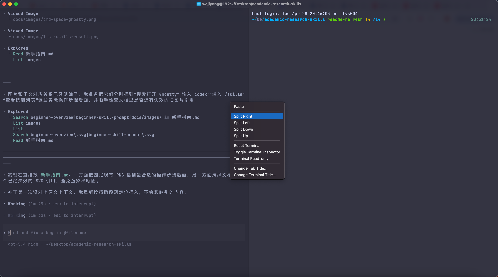
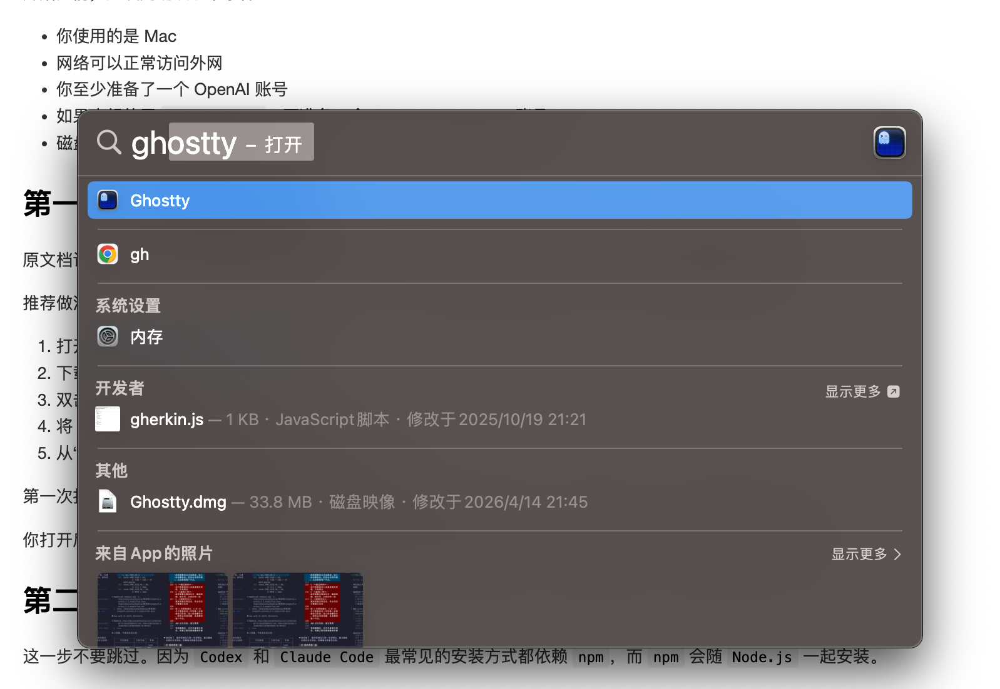
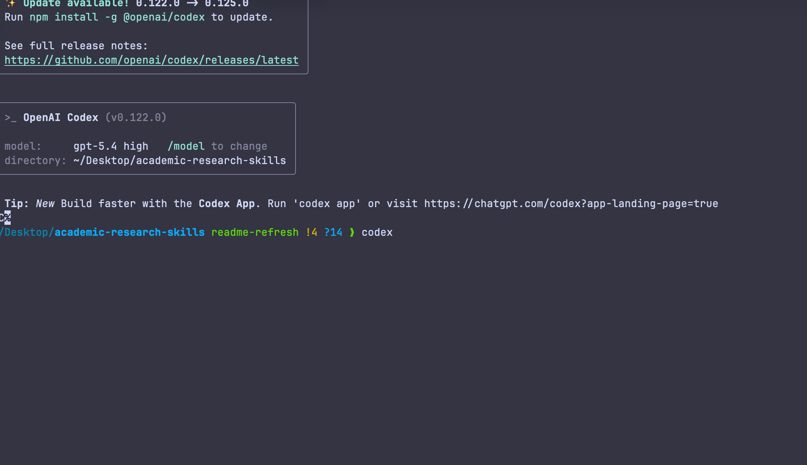
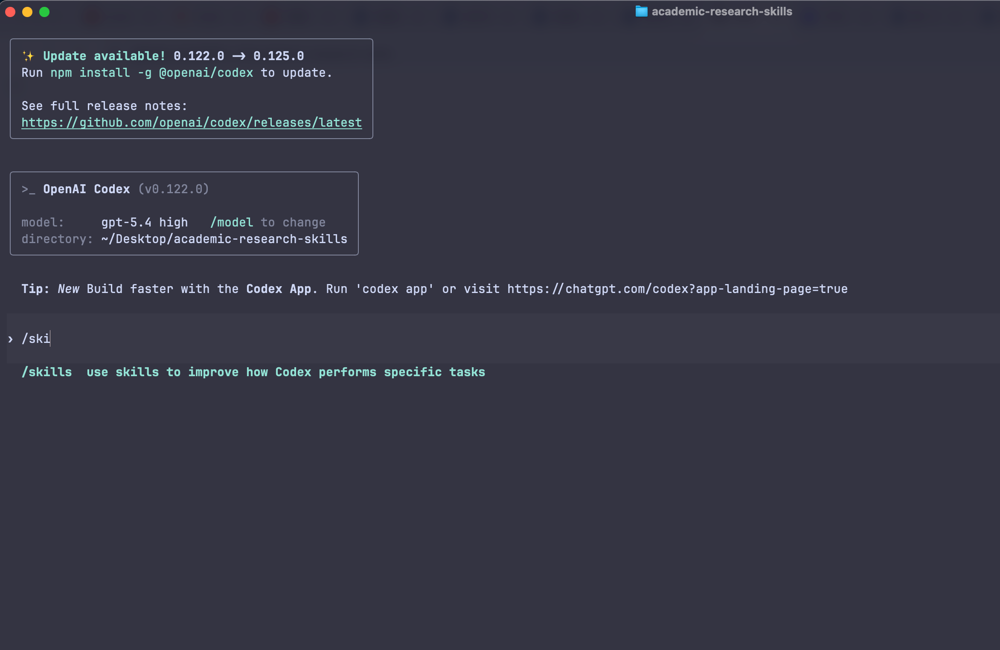
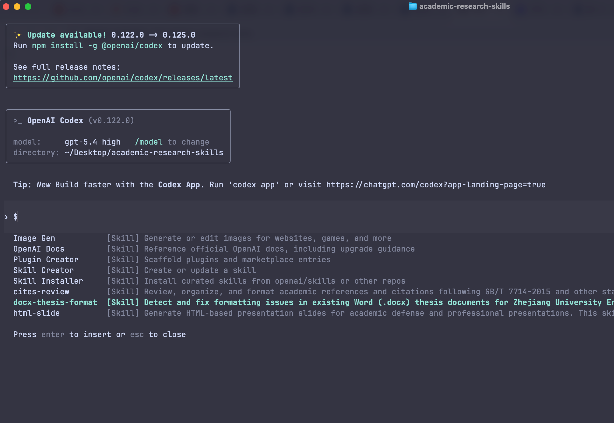

# 新手指南：从安装到第一次使用

适用对象：第一次接触终端、没有编程基础、希望尽快用上本仓库学术技能的教师、学生与研究助理。

本文以下内容以 **macOS** 为主。原仓库文档中的版本信息均以 **2026 年 4 月 28 日** 为时间基准，适合作为当前操作参考。

## 先建立一个最简单的认识

如果你以前没有接触过这类工具，可以先把它们理解成三件东西：

- `Ghostty` 是终端窗口，也就是你输入命令的地方。
- `Codex` 是主要入口，本仓库的 skill 默认就是安装到它的技能目录里。
- `Claude Code` 是兼容入口，适合让它直接阅读仓库文件、脚本和 `SKILL.md` 后帮你执行任务。

只记一句话也够用：

> `Ghostty` 是窗口，`Codex` 和 `Claude Code` 是在窗口里工作的智能助手。

## 推荐路线

如果你的目标只是“尽快用起来”，按下面顺序做最省事：

1. 安装 `Ghostty`
2. 安装 `Node.js`
3. 安装 `Codex`
4. 按需要安装 `Claude Code`
5. 打开 `codex` 或 `claude`
6. 直接让工具帮你下载本仓库并完成安装


## 这个仓库能帮你做什么

本仓库不是通用聊天资料包，而是一组面向学术研究任务的可复用 skill。你通常不需要先学会内部实现，只需要知道每个 skill 适合解决什么问题。

| skill 名称 | 适合处理的任务 | 常见输入 | 常见输出 |
|------|------|------|------|
| `literature-review` | 补写文献综述、补近年研究、整理参考文献 | 研究主题、提纲、旧综述 | 综述正文、参考文献 |
| `cites-review` | 检查参考文献格式与正文编号 | 参考文献列表、正文引用 | 修正建议、重编号结果 |
| `word-flowchart` | 生成技术路线图、流程图 | 流程描述、草图、Mermaid | DOT、流程图图片 |
| `markdown-to-word` | 把 Markdown 论文稿转成 Word | `.md` 文稿、图片、公式 | `.docx` |
| `docx-thesis-format` | 检查并修复已有 Word 论文格式 | `.docx` 论文 | 修复版 `.docx`、检查报告 |
| `html-slide` | 生成答辩或汇报用 HTML 幻灯片 | 提纲、讲稿、章节内容 | `slides/*.html` |
| `authorial-rewrite` | 深度重写 AI 辅助生成的学术草稿 | AI 初稿、作者观点、真实文献 | 更像作者写作的学术文本 |

其中，`authorial-rewrite` 最容易被误解。它的正确用途不是“绕过检测”，而是把空泛、模板化、机器腔明显的草稿，重写成论点、证据、分析和边界更清楚的学术表达。

## 安装前准备

开始之前，建议先确认以下条件：

- 你使用的是 Mac
- 网络可以正常访问外网
- 你至少准备了一个 OpenAI 账号
- 如果也想使用 `Claude Code`，再准备一个 Claude / Anthropic 账号
- 磁盘最好预留至少 5 GB 可用空间

## 第一步：安装 Ghostty

原文档记录显示，截至 **2026 年 4 月 28 日**，Ghostty 官方稳定版下载页面向 macOS 的安装路径最直接。

推荐做法如下：

1. 打开 <https://ghostty.org/download>
2. 下载 macOS 安装包
3. 双击打开 `.dmg`
4. 将 `Ghostty.app` 拖到“应用程序”
5. 从“启动台”或“应用程序”中打开 `Ghostty`

第一次打开时，如果系统弹出安全提示，选择允许即可。

你打开后看到的会是一个深色终端窗口，里面有一行等待输入的提示符。后面所有命令，基本都在这里完成。

如果你后面想一边看说明、一边输入命令，可以先学会 `Ghostty` 的分屏。最直接的方法是：在终端窗口里右键，然后选择 `Split Right`、`Split Left`、`Split Down` 或 `Split Up`，这样就能在同一个窗口里拆出新的终端区域。

对新手来说，最常用的是 `Split Right`。左边放教程或前一步输出，右边继续输入命令，会更不容易来回切换看丢内容。

下面这张图展示的就是在 `Ghostty` 里右键后，选择分屏方向的界面：



## 第二步：安装 Node.js

这一步不要跳过。因为 `Codex` 和 `Claude Code` 最常见的安装方式都依赖 `npm`，而 `npm` 会随 `Node.js` 一起安装。

原文档记录显示，截至 **2026 年 4 月 28 日**，Node.js 官方下载页给出的最新 LTS 为 **v24.14.1**。对零基础用户来说，直接选择 **LTS** 即可，不建议选 Current。

安装步骤：

1. 打开 <https://nodejs.org/en/download>
2. 下载 `LTS` 安装包
3. 按默认设置完成安装
4. 按 `cmd+space`，搜索 `Ghostty` 并启动
5. 在打开的窗口里输入：

```bash
node -v
npm -v
```

6. 如果这两条命令都能显示版本号，就说明安装完成。

例如，启动 `Ghostty` 时可以参考下面这个搜索界面：



## 第三步：安装 Codex

`Codex` 是本仓库最直接的使用入口。原文档记录显示，截至 **2026 年 4 月 28 日**，官方帮助中心给出的安装方式是通过 `npm` 安装 Codex CLI。

安装时按下面顺序操作：

1. 按 `cmd+space`，搜索 `Ghostty` 并启动
2. 在打开的窗口里输入：

```bash
npm install -g @openai/codex
```

3. 等待安装完成后，再输入：

```bash
codex
```

如果你不确定是不是已经成功进入 `Codex`，可以参考下面这个终端界面：



4. 按屏幕提示完成登录

原文档记录的常见登录方式有两种：

- 使用 `ChatGPT` 订阅账号登录
- 使用 `OpenAI API Key` 登录

如果你是第一次使用，优先选择 `ChatGPT` 账号登录更省事。

如果你当前不方便直接使用官方入口，也可以把下面的国内入口当作备选参考：

- <https://codexzh.com/usage>

需要特别说明的是：`Codex` 装好以后，还需要先完成模型配置，之后才能正常运行。如何配置，建议参考：

- <https://docs.codexzh.com/codex/>

## 第四步：安装 Claude Code

这一步是可选项，但建议保留。很多零基础用户在第一次排错时，会明显感受到第二个助手的价值。

原文档记录显示，截至 **2026 年 4 月 28 日**，Anthropic 官方要求通过 `npm` 安装 `Claude Code`，并且：

- `Node.js 18+`

安装步骤：

1. 按 `cmd+space`，搜索 `Ghostty` 并启动
2. 在打开的窗口里输入：

```bash
npm install -g @anthropic-ai/claude-code
```

3. 安装完成后，再输入：

```bash
claude
```

4. 按提示完成登录

如果你是个人用户，直接选择 `Claude.ai` 账号登录即可。

如果你当前不方便直接使用官方入口，也可以把下面的国内入口当作备选参考：

- <https://ccodezh.com/>

同样需要特别说明：`Claude Code` 装好以后，也需要先完成模型配置，之后才能正常运行。如何配置，建议参考：

- <https://docs.codexzh.com/claude-code/>

## 第五步：让 Codex 或 Claude Code 自动下载并安装本仓库

对完全没有命令行经验的人来说，最省事的方式往往不是自己逐条判断报错，而是让助手直接接管安装过程。

那么你可以把下面这段话直接发给 `Codex`：

```text
请你在当前电脑上帮我安装 academic-research-skills 里的 skills。

仓库地址是：
https://github.com/WEN-JY/academic-research-skills

请按下面要求执行：
1. 从 GitHub 下载这个仓库
2. 运行仓库里的安装脚本，完成 skills 安装
3. 告诉我如何确认是否安装成功
4. 告诉我已经安装了哪些 skill
5. 如果报错，请直接解释原因，并给出下一步处理办法

我没有编程基础，请尽量少用术语。
```

如果你更想让 `Claude Code` 来做，可以发这段：

```text
请你帮我安装 academic-research-skills 这套技能。

仓库地址是：
https://github.com/WEN-JY/academic-research-skills

请你：
1. 从 GitHub 下载这个仓库
2. 运行仓库里的安装脚本，完成 skills 安装
3. 告诉我如何确认是否安装成功
4. 用通俗中文告诉我安装是否成功
5. 如果失败，请直接告诉我应该怎么修复

我是零基础用户，请不要只给我命令，要解释我现在该做什么。
```

当然，这种方法的前提仍然是你已经先装好了 `Ghostty`，并且至少装好了 `Codex` 或 `Claude Code` 中的一个。

安装完以后，不必再去看文件夹或路径。直接这样确认就够了：

1. 打开 `Codex` 或 `Claude Code`
2. 输入 `/skills`
3. 查看返回的 skill 列表

输入 `/skills` 时，界面大致会像下面这样：



如果列表中能看到下面这些 skill，就说明安装成功：

- `authorial-rewrite`
- `cites-review`
- `docx-thesis-format`
- `html-slide`
- `literature-review`
- `markdown-to-word`
- `word-flowchart`

如果你已经看到 skill 列表，界面通常会类似下面这样：



## 第六步：第一次调用 skill

安装完成后，推荐把 `Codex` 作为主入口。

按 `cmd+space`，搜索 `Ghostty` 并启动。在打开的窗口里输入：

```bash
codex
```

然后直接用自然语言说需求，但要明确点出 skill 名称。最稳妥的提问方式是：

```text
请使用 [skill 名称] 帮我处理任务。

输入材料：
目标：
输出格式：
补充要求：
```

这个模板看起来简单，但很有效。因为它避免助手只理解到一半，又反过来追问你很多轮。

下面给三个最常见的例子。

文献综述：

```text
请使用 literature-review 帮我处理任务。

输入材料：研究主题是“重大工程项目韧性与风险响应”，我已经有一个二级标题提纲。
目标：补充近 3 年文献综述。
输出格式：Markdown 正文 + 参考文献列表。
补充要求：优先中文核心、SSCI、SCI。
```

Markdown 转 Word：

```text
请使用 markdown-to-word 帮我处理任务。

输入材料：当前目录里的 `chapter3.md`。
目标：转换成可继续修改的 Word 文档。
输出格式：`.docx`。
补充要求：保留公式、表格和图片。
```

降低AI率AI：

```text
请使用 authorial-rewrite 帮我处理任务。

输入材料：下面是一段 AI 辅助生成的论文草稿。
目标：减少机器腔和模板化表达，但保留原来的核心意思。
输出格式：重写后的学术段落。
补充要求：请加强论点、证据、分析和边界条件的对应关系。
```

## Claude Code 应该怎么配合使用

如果安装已经完成，日常最直接的入口仍然是 `Codex`。但 `Claude Code` 很适合做另一类事情：它不一定非要靠已安装的 skill 才能工作，也可以直接读取仓库里的脚本、说明和 `SKILL.md`。

例如你可以这样说：

```text
请参考当前仓库里的 `skills/markdown-to-word/SKILL.md`，
把当前目录下的 `chapter3.md` 转成 Word，并告诉我生成的文件在哪里。
```

或者这样说：

```text
请参考当前仓库里的 `skills/docx-thesis-format/SKILL.md`，
检查并修复 `论文终稿.docx`，输出修复版和报告。
```

如果你的任务涉及多个文件联动、文档修改或脚本排错，`Claude Code` 往往会比较顺手。

## 新手最值得记住的两条命令

如果你只想先把最核心的东西记住，记下面两条就够了：

```bash
codex
claude
```

它们分别表示打开 `Codex` 和 `Claude Code`。安装仓库这一步，优先让工具自己去完成，不建议你手动折腾。
